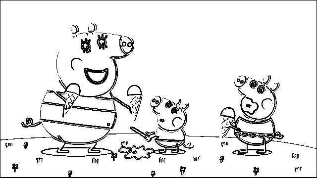
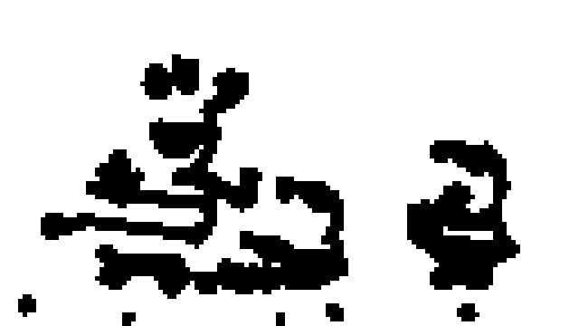

# Visual input
Video is split into images that are of given standard size. The algorithm
assumes that the images are `640x360` pixels. The machine learning part will
make no such assumptions and is only bound by the format of the output data from
the algorithm. Therefore the algorithm can later on be replaced for a more
sophisticated one should the model prove workable.

The processing of the visual input happens in 3 phases:

1) Video gets split into frames at certain rate that makes sense for the domain
(low FPS data such as cartoons can be processed faster).
2) Images are sent though the algorithm described in this document.
3) Visual data are matched to the audio data.

## Setting up
Single image is loaded from the dataset.


## Edge finding
The image is converted to grayscale and two filters are used on the image:

```
horizontal_edge_filter = [
  EDGE , EDGE , EDGE
  0    , 0    , 0
  -EDGE, -EDGE, -EDGE
]

vertical_edge_filter = [
  EDGE, 0, -EDGE
  EDGE, 0, -EDGE
  EDGE, 0, -EDGE
]
```

After applying these two filters, all pixel values that are not `0` or `255` for
black and white respectively are changed to `255` and values `0` and `255` are
changed to `0`.



## Object detection
To find the most important areas on the image a pixel density map is
built. The resolution of the resulting map is based on a `CELL_SIZE` setting.

Cell is a square that represents size*size pixels of the original image with
a single number. It is used to track density of edges. The larger the cell
size the lower the resolution of the heat map. The lower the cell size the
less abstract the heat map becomes. It has to be a number that is divides
both image width and image hight without a rest.

Ideally the learning process would decrease the `CELL_SIZE` with each re-watch.

### Bricked heat map
Calculates the heat map of overlaying cells. Most pixels therefore belong
to 4 cells. Pixels on the edges of the image belong to 2 cells and pixels
in the corners belong to one cell.

In the following diagram, there are 4 cells where each cell is of the same
size (e.g. cell 0x0 contains CELL_SIZE*CELL_SIZE pixels).

```
a: row 0, col 0
b: row 0, col 1
c: row 1, col 0
d: row 1, col 1

  ____0___________1_____
0 |   a    ab     b...
  |   ac   abcd   bd...
1 |   c... cd...  d...
```

### Heat map
Transforms the bricked heat map where the cells are of `CELL_SIZE` to a more
granular one where cells are `CELL_SIZE / 2`. This gives us better detail
while preserving relationships between all parts of the image rather than
cropping out a block and calculating the heat separately.

### Cellular automaton
Heat map has large range of values for each cell and contains lots of small
unimportant edges artifacts. The map is run through a cellular automaton with
three rules that decide based on a mean heat of cells Moore neighbourhood
whether a cell is killed, meaning it is not part of any of the most important
features, or kept alive. Cells that are killed (have heat of `0`) and that
reached maximum heat are stabilized (they cannot change their heat in following
cycles). Once all cells are stabilized, the automaton finishes.


